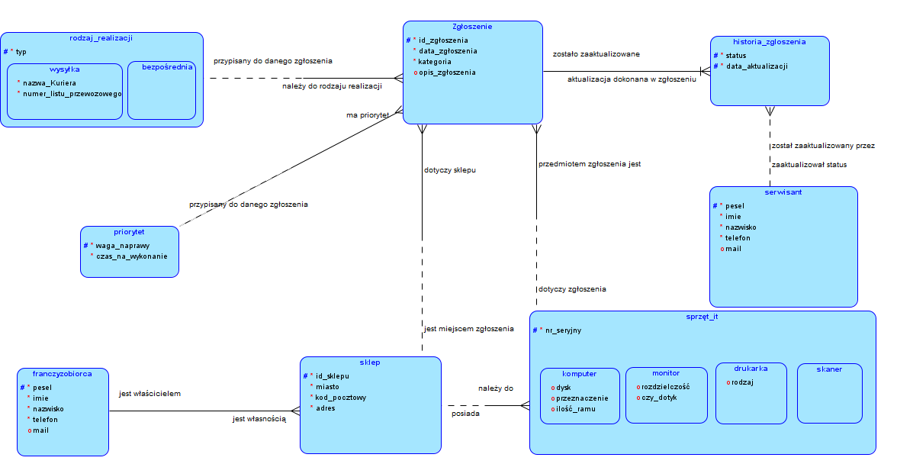
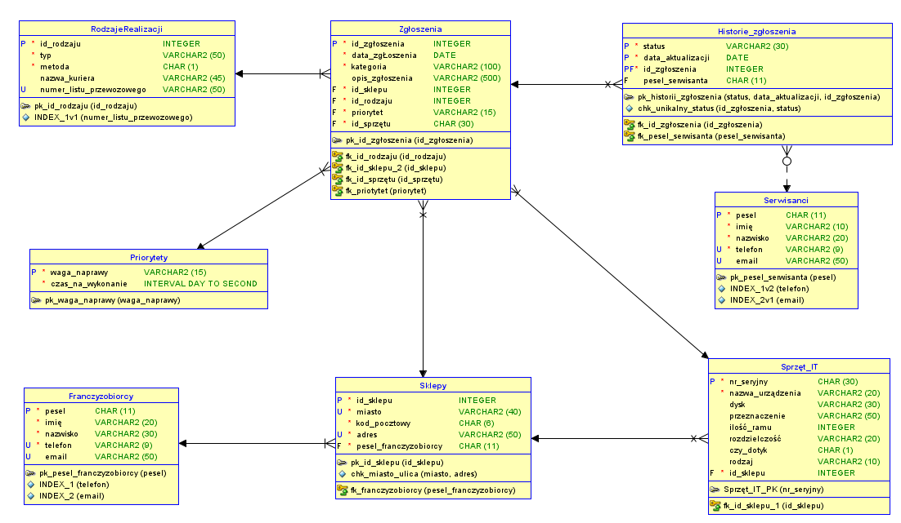

# IT-service-databases

Projekt dotyczy stworzenia systemu do obsługi awarii informatycznych dla sieci sklepów spożywczych działających na zasadzie franczyzy. System ma na celu usprawnienie zgłaszania, zarządzania oraz rozwiązywania problemów technicznych, które mogą pojawiać się w poszczególnych placówkach. Baza danych ma stanowić centralne repozytorium informacji o zgłoszeniach awarii, ich bieżącym statusie oraz kluczowych szczegółach związanych z procesem ich obsługi.

Użyta technologia:
- SQL
- Oracle SQL Developer
- Oracle Database 23 AI

<h2>Diagram związków encji</h2>

<h2>Diagram encji</h2>

<h3>Opisz poszczególnych encji</h3>

1. Zgloszenia - przechowuje informacje o awariach zgłaszanych przez sklepy:
- id_zgloszenia – unikalny identyfikator zgłoszenia
- data_zgloszenia – data zgłoszenia problemu
- kategoria – rodzaj awarii 
- opis_zgloszenia – szczegółowy opis awarii
- id_sklepu – powiązany sklep
- id_rodzaju – rodzaj realizacji naprawy
- priorytet – priorytet zgłoszenia
- id_sprzetu – identyfikator uszkodzonego sprzętu

2. Historie_zgloszenia - przechowuje historię statusów zgłoszeń:
- status – aktualny status zgłoszenia
- data_aktualizacji – data zmiany statusu
- id_zgloszenia – powiązane zgłoszenie
- pesel_sewisanta – serwisant przypisany do zgłoszenia

3. Serwisanci - lista osób zajmujących się naprawami:
- pesel – unikalny identyfikator serwisanta
- imie, nazwisko – dane personalne
- telefon, email – kontakt do danego serwisanta

4. RodzajeRealizacji - sposób naprawy zgłoszonej awarii:
- id_rodzaju – unikalny identyfikator
- typ – sposób realizacji 
- metoda – metoda naprawy
- nazwa_kuriera – indetyfikator kuriera
- numer_listu_przewozowego – numer przesyłki kurierskiej

5. Priorytety - określa czas na wykonanie naprawy:
- waga_naprawy – poziom priorytetu zgłoszenia
- czas_na_wykonanie – maksymalny czas na naprawę

6. Sklepy - reprezentuje sklepy franczyzowe, które mogą zgłaszać awarie:
- id_sklepu – unikalny identyfikator sklepu
- miasto, adres, kod_pocztowy – dane adresowe
- pesel_franczyzobiorcy – właściciel sklepu (franczyzobiorca)

7.  Franczyzobiorcy - przechowuje dane właścicieli sklepów:
- pesel – unikalny identyfikator właściciela
- imie, nazwisko – dane personalne
- telefon, email – kontakt

8. Sprzęt IT - baza sprzętu komputerowego w sklepach:
- nr_seryjny – unikalny numer seryjny
- nazwa_urzadzenia – nazwa sprzętu 
- dysk, ilosc_ramu – parametry techniczne sprzętu
- czy_dotyk – czy sprzęt posiada ekran dotykowy 
- id_sklepu – sklep, w którym znajduje się sprzęt
  
